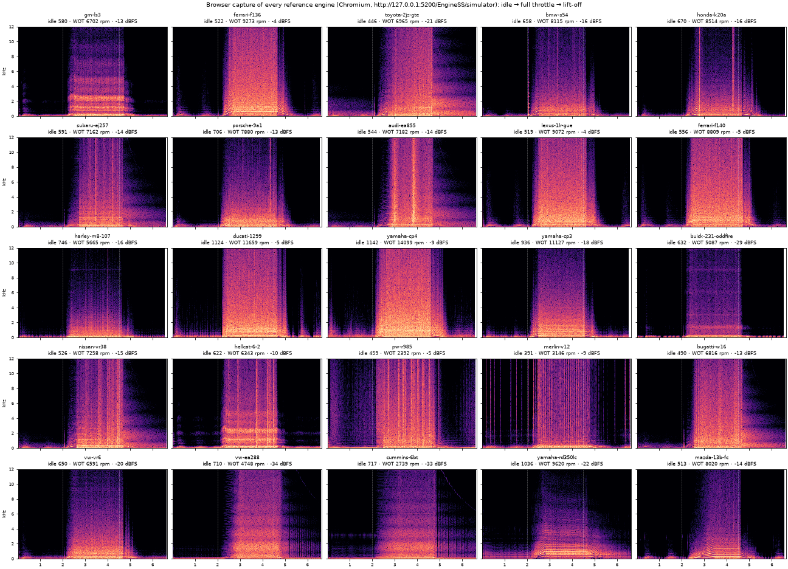

# Browser verification

How the shipped app was checked in a real browser, and what that found. Re-run with:

```bash
npm run build && GITHUB_PAGES=true npx vite preview --port 5200 &      # the build Pages serves
npm run test:browser -- --url http://127.0.0.1:5200/EngineSS/simulator --out browser-smoke --stress
python3 scripts/browser/report.py browser-smoke                         # spectrogram sheet (numpy, scipy, matplotlib)
```

`scripts/browser/smoke.mjs` drives the real UI in Chromium 141 (Playwright, headless) through the production build. It records the audio the worklet actually produces, tapped after the output limiter, so the capture is exactly what reaches the speakers. Headless Chromium renders to a timer-driven null sink, so a render that falls behind real time shows up as the audio clock lagging the wall clock ("Audio clock" below).

Results here are from the final run on 2026-10-04 (4 vCPU container). All checks pass, with no console errors.

## Every reference engine

Each engine is selected from the preset menu, then idles for 2 s, runs 2.5 s at full throttle (free rev, so it reaches the limiter), and lifts off for 2 s. Pass criteria: no non-finite samples, idle louder than −60 dBFS, full throttle louder than idle, no silent gap over 20 ms, rpm rises by at least 1.5×, audio clock at least 97 % of real time, and no clipped samples.



| Engine | Internal rate | Idle rpm | WOT max rpm | Idle dBFS | WOT dBFS | Peak | Longest gap | Audio clock | Worklet load |
|---|---|---|---|---|---|---|---|---|---|
| gm-ls3 | 48 kHz | 580 | 6702 | -35.7 | -12.7 | 0.93 | 0.0 ms | 101.2 % | 64 % |
| ferrari-f136 | 48 kHz | 522 | 9273 | -30.8 | -3.7 | 0.93 | 0.0 ms | 100.1 % | 59 % |
| toyota-2jz-gte | 48 kHz | 446 | 6965 | -44.4 | -21.5 | 0.93 | 0.0 ms | 100.2 % | 54 % |
| bmw-s54 | 48 kHz | 658 | 8115 | -42.7 | -16.4 | 0.92 | 0.0 ms | 100.1 % | 64 % |
| honda-k20a | 48 kHz | 670 | 8514 | -48.3 | -16.2 | 0.92 | 0.1 ms | 100.0 % | 49 % |
| subaru-ej257 | 48 kHz | 591 | 7162 | -42.8 | -14.1 | 0.93 | 0.0 ms | 100.0 % | 46 % |
| porsche-9a1 | 48 kHz | 706 | 7880 | -41.0 | -12.6 | 0.92 | 0.1 ms | 100.0 % | 54 % |
| audi-ea855 | 48 kHz | 544 | 7182 | -48.6 | -13.5 | 0.94 | 0.1 ms | 100.0 % | 50 % |
| lexus-1lr-gue | 48 kHz | 519 | 9072 | -32.6 | -4.4 | 0.94 | 0.1 ms | 100.0 % | 67 % |
| ferrari-f140 | 40 kHz | 556 | 8809 | -32.2 | -4.6 | 0.97 | 0.0 ms | 100.2 % | 67 % |
| harley-m8-107 | 48 kHz | 746 | 5665 | -42.7 | -15.8 | 0.90 | 1.2 ms | 100.1 % | 59 % |
| ducati-1299 | 48 kHz | 1124 | 11659 | -31.6 | -5.4 | 0.93 | 1.3 ms | 100.1 % | 27 % |
| yamaha-cp4 | 48 kHz | 1142 | 14099 | -36.0 | -8.6 | 0.94 | 0.0 ms | 100.0 % | 36 % |
| yamaha-cp3 | 48 kHz | 936 | 11127 | -40.6 | -18.2 | 0.63 | 0.2 ms | 99.1 % | 35 % |
| buick-231-oddfire | 48 kHz | 632 | 5087 | -46.2 | -29.3 | 0.15 | 7.8 ms | 100.0 % | 46 % |
| nissan-vr38 | 48 kHz | 526 | 7258 | -41.9 | -15.4 | 0.93 | 0.1 ms | 100.1 % | 58 % |
| hellcat-6-2 | 40 kHz | 622 | 6343 | -28.8 | -10.2 | 0.96 | 0.0 ms | 100.3 % | 54 % |
| pw-r985 | 48 kHz | 459 | 2392 | -19.3 | -5.4 | 0.94 | 0.0 ms | 100.1 % | 49 % |
| merlin-v12 | 48 kHz | 391 | 3146 | -29.3 | -8.8 | 0.93 | 0.0 ms | 100.2 % | 81 % |
| bugatti-w16 | 32 kHz | 490 | 6816 | -43.3 | -13.3 | 0.93 | 0.1 ms | 100.1 % | 74 % |
| vw-vr6 | 48 kHz | 650 | 6591 | -47.7 | -19.7 | 0.38 | 0.1 ms | 100.0 % | 62 % |
| vw-ea288 | 48 kHz | 710 | 4748 | -55.2 | -34.1 | 0.08 | 0.6 ms | 100.1 % | 47 % |
| cummins-6bt | 48 kHz | 717 | 2739 | -53.8 | -33.0 | 0.10 | 0.1 ms | 100.1 % | 52 % |
| yamaha-rd350lc | 48 kHz | 1036 | 9620 | -50.7 | -21.7 | 0.31 | 0.1 ms | 100.3 % | 45 % |
| mazda-13b-fc | 48 kHz | 513 | 8020 | -34.7 | -13.6 | 0.76 | 3.2 ms | 100.3 % | 43 % |

"Idle rpm" is the median over 0.8–2.0 s after the preset switch, so engines that are still settling read low here. "Worklet load" is the worklet's own measurement of its share of the audio thread. On an idle page it matches a burst benchmark of the same engine on the audio thread to within 3 %. During this test it also includes contention from the page and from Playwright.

## Controls

| Control | Result |
|---|---|
| Free rev: throttle raises rpm, Idle returns it | pass: back to 925 rpm |
| Throttle slider round-trips to the worklet | pass: throttle 30 % → 2485 rpm |
| Dyno hold holds the set-point at full throttle | pass: 3000 rpm, 562 N·m |
| Ignition off stops the engine; Crank / start restarts it | pass: states seen: off → cranking → running; idling at 1342 rpm |
| Drive mode: launch, auto-shift, manual shifts, brake | pass: 124 km/h in gear 2 after 6 s; shifts 2→1→2; brake to 0 km/h |
| Dyno pull button runs WOT to redline and lifts | pass: peak 6622 rpm, then lift to free rev |
| Listener perspective round-trips | pass: exterior-rear 79 dB, exterior-side 67 dB, engine-bay 66 dB, cabin 73 dB, dyno-tailpipe 91 dB |
| Stem gain slider changes the output level | pass: -35.4 → -98.2 dBFS with exhaust stems at 0 |
| Engine Type → four-stroke:diesel: worklet rebuilds, family panel shows | pass: 8 chambers, 6.16 L, WOT 4687 rpm |
| Engine Type → two-stroke:gasoline: worklet rebuilds, family panel shows | pass: 8 chambers, 6.16 L, WOT 4816 rpm |
| Engine Type → rotary:gasoline: worklet rebuilds, family panel shows | pass: 6 chambers, 3.90 L, WOT 4823 rpm |
| Engine Type → four-stroke:gasoline: worklet rebuilds, family panel shows | pass: 2 chambers, 1.54 L, WOT 4805 rpm |
| Rotors count changes the firing schedule | pass: rotors seen: 1, 2, 3, 4 |

## Rate tiering

- **Tier choice at build:** every engine was given the highest internal rate its cost estimate allows on this machine: 48 kHz for most, 40 kHz for the F140 and Hellcat, and 32 kHz for the W16.
- **Step-down under overload:** in Chromium, the audio thread runs at real-time priority. Twelve busy-loop processes on four cores did not slow it (audio clock 100.0 %), so no step-down was needed. The step-down path is therefore tested in Node with the real worklet class and a clock that reports 94 % load (`client/src/lib/ess/essProcessor.test.ts`). It steps 48 → 40 → 32 kHz after two half-second windows each, stops at the lowest tier, and the output never goes silent for even 1 ms across the crossfades.
- **`performance` is undefined in `AudioWorkletGlobalScope`** in Chromium 141. The worklet falls back to `Date.now()` (1 ms resolution). That clock is unbiased on average, and the load it reports matches burst benchmarks (see above).

## Export (client-side, Export dialog)

| Engine | Length | Format | Peak | RMS | Render time | Longest page stall |
|---|---|---|---|---|---|---|
| vw-ea288 | 10.00 s | 44100 Hz, 2 ch, 16-bit | 0.95 | -15.6 dBFS | 4.4 s | 217 ms |
| yamaha-rd350lc | 10.00 s | 44100 Hz, 2 ch, 16-bit | 0.95 | -14.0 dBFS | 3.6 s | 167 ms |
| mazda-13b-fc | 10.00 s | 44100 Hz, 2 ch, 16-bit | 0.95 | -12.4 dBFS | 4.0 s | 166 ms |
| toyota-2jz-gte | 10.00 s | 44100 Hz, 2 ch, 16-bit | 0.95 | -19.1 dBFS | 5.2 s | 183 ms |

Export now renders in a Web Worker (`client/src/lib/ess/renderWorker.ts`). Before that, the same renders blocked the page for their full 4–5 s.

## Problems found and fixed

| Problem | Evidence | Fix |
|---|---|---|
| 16 of 25 engines clipped at full throttle | F140 peaked at 1.34 (9,658 clipped samples); LS3, K20A, Ducati and others hit 1.0 | The output stage is now a limiter (−3 dB threshold, 20:1, 6 ms look-ahead) instead of the near-transparent −1 dB, 1.5:1 compressor. The physical calibration is unchanged, so level differences between engines below −3 dBFS survive. Peaks now ≤ 0.97. |
| "Full throttle", "Idle" and "Blip" left Drive mode | 0 km/h after 6 s of "full throttle" in Drive | Quick actions switch to free rev only from the dyno; in Drive they work the pedal |
| Export froze the page | 4–5 s with no frames during a 10 s render | Render in a Web Worker; longest stall now ≤ 217 ms |
| Throttle and load sliders lagged a frame behind the input | Fast key presses moved the throttle 1 % instead of 30 % | The hook updates throttle and load state immediately |
| Capture tab overflowed the tab bar | Screenshot | Tabs wrap and use tighter padding |
| A 404 on every page load | Console error from `/favicon.ico` | Inline SVG favicon |

## Seen in the captures, not yet explained

- **Diesel lift-off** (EA288, Cummins): regular broadband striations at about 10 Hz while the engine runs down. This could be governor hunting on the way to idle.
- **Merlin V12 at idle:** periodic broadband clicks, about every 0.25 s.
- **Buick 231 odd-fire at idle:** near-silent gaps of about 8 ms between firing pairs. A real exhaust system would ring through them.
- **Level spread:** the diesels peak at about −34 dBFS at full throttle against −4 dBFS for the V10/V12, about 30 dB apart at the same 3 m rear position. That spread is physically plausible but makes the diesels hard to hear without turning up the volume.
- A mono downmix of the stereo (two-ear) output comb-filters: notches near 6 and 8.7 kHz appear in an L+R sum and vanish in either ear alone. Any tool that sums the channels will show them.
